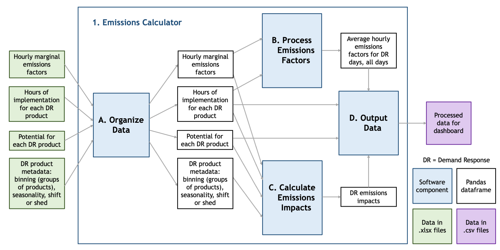

# Phase 1: The Emissions Calculator

This package is Component 1 of the Demand Response Emissions Impact project. The emissions calculator processes and outputs data to a processed data directory for Component 2, the Dashboard Generator, to access and visualize in a user-friendly webpage. The component design for the Emissions Calculator is shown below. For more details, see the component specification in the <code>docs/</code> folder in the root directory of this repository.

The <code>emissions_calculator.py</code> script runs through subcomponents A-D in order to A) read and organize the input data into dataframes; B) calculate averages of hourly emissions factors for visualization; C) calculate emissions impacts of demand response implementation; and D) output the resulting arrays into data files in the processed data directory. 

Directories and useful constants are defined in <code>emissions_parameters.py</code> for use in the subcomponents. 

Test scripts for the overarching <code>phase1_emissions_calculator</code> and each subcomponent are also included in this directory, and are titled <code>test_(componentname).py</code>
