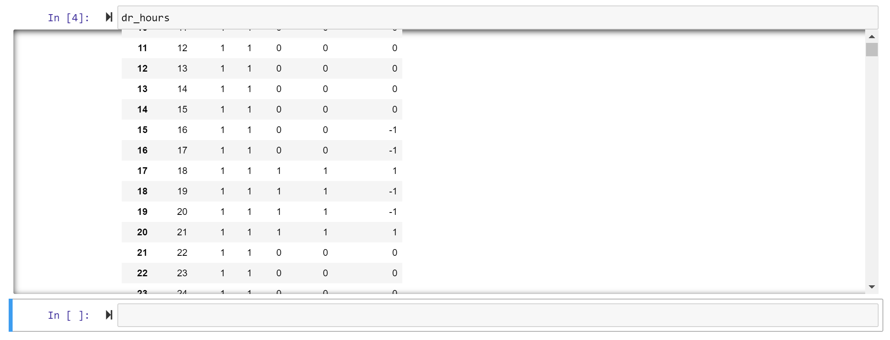

# Subcomp_c feedback

## Bug in shift_hours

* The shifting isn't quite working, see output screen capture above and note in script
* Not all products have 4 hours periods--some have 6 hour periods. This needs to also work for a product with six hour period, so maybe you should count the consecutive 1s (4 or 6), divide by two, and shift by that much

## Doc strings
Fill out doc string with what the function does, and define the args and returns. I did a few but some are still missing. Also remember to pylint the script--looks like some lines are too long.

## Changes for calc_yearly_avoided_emissions
* The dr plan names (here called 'bins') and seasons should be arguments in calc_yearly_avoided_emissions - they're specified by the user as  'dr_name' and 'dr_seasons' in emissions_calculator.py.
* Please also loop through the emissions scenario, where the list of scenarios is an input (emissions_scenario_list in the emissions_calculator). Currently there's just Baseline but we might add more.
* Bug for the the leap year: I think we need to delete emissions rates for February 29, not december 31. If we don't delete February 29, everything will be offset so that we won't be using the right emissions rates for the right days. 
* I edited subcomp_a to create resTOU_shift and resTOU_shed, so you can get rid of all the if/else statements related to this. The regular code for all the other products will now work for this too. Just be sure when you're calculating the bin total, to calculate one total for DVR + resTOU_shift and one for DVR + resTOU_shed.

