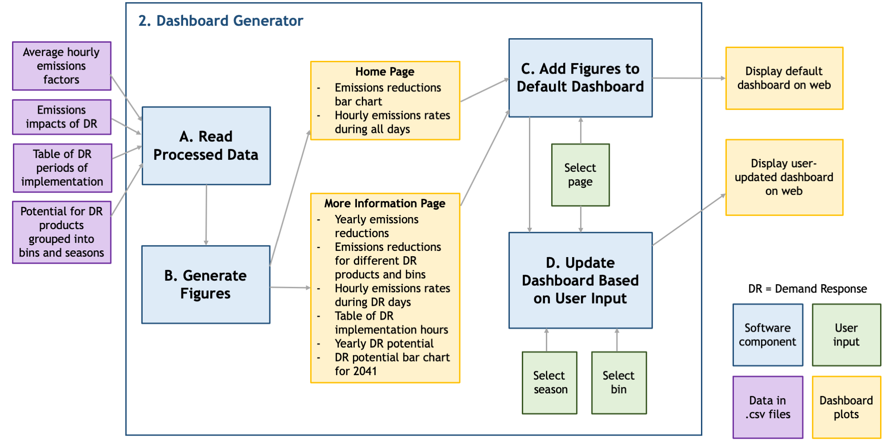

# Phase 2: The Dashboard Generator

This package contains modules devoted to making the dashboard to be deployed on the web via Heroku. The component design for this package is shown below. See the <code>docs/</code> folder in the root directory of this repository for more details on the component specification.

The modules are:

* <code>home.py</code>: This python script contains the layout code for the home page. It calls on the main <code>app.py</code> script for the plot callbacks, the <code>read_files.py</code> module for reading the processed datasets, and the <code>make_plots.py</code> module to generate the graph objects. It sends the information to the <code>index.py</code> script for deployment to the web.
* <code>make_plots.py</code>: This python script contains functions for making all of the dashboard plots and dropdown menus with plotly.
* <code>more_info.py</code>: This python script contains the layout for the more information page. It calls on the main <code>app.py</code> script for the plot callbacks, the <code>read_files.py</code> module for reading the processed datasets, and the <code>make_plots.py</code> module to generate the graph objects. It sends the information to the <code>index.py</code> script for deployment to the web.
* <code>read_files.py</code>: This python script contains the functions for reading in the processed datasets.
